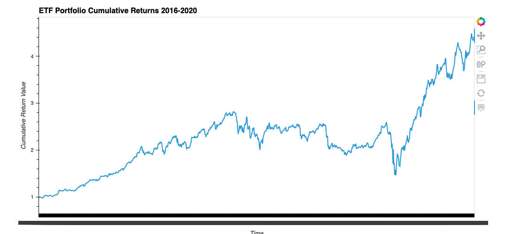

# Web Application for an ETF Analyzer
We’ll build a financial database and web application by using SQL, Python, and the Voilà library to analyze the performance of a hypothetical fintech ETF.

## Technologies
Web Application for an ETF Analyzer project leverages python 3.7 with the following packages:

[Pandas](https://github.com/pandas-dev/pandas "Pandas") 
SQL
Voila

## Installation Guide

First install the following libraries and dependencies.

```
# conda
conda install pandas
```

```
import numpy as np
import pandas as pd
import hvplot.pandas
import sqlalchemy
import voila
```

## Usage

**Analyze a Single Asset in the ETF**


**Optimize Data Access with Advanced SQL Queries**

**Analyze the ETF Portfolio**

```
query = """SELECT *
           FROM GDOT
           INNER JOIN PYPL ON
           GDOT.time = PYPL.time
           INNER JOIN GS ON
           GDOT.time = GS.time
           INNER JOIN SQ ON
           GDOT.time = SQ.time
"""
```



**Deploy the Notebook as a Web Application**


## Contributors

* Brought to you by Olga Koryachek.
* Email: olgakoryachek@live.com
* [LinkedIn](https://www.linkedin.com/in/olga-koryachek-a74b1877/?msgOverlay=true "LinkedIn")


---

## License

Licensed under the [MIT License](https://choosealicense.com/licenses/mit/)
